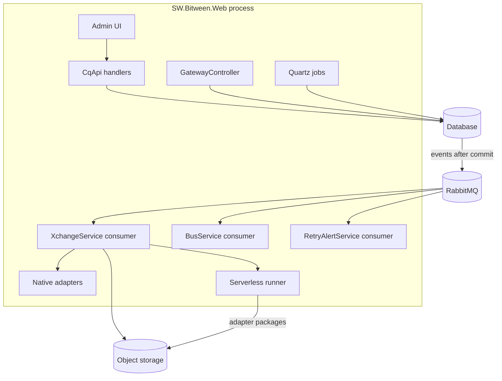

# Architecture

## One service

Bitween runs as a single ASP.NET Core process built from `SW.Bitween.Web`. Every replica does all of the following.

| Role | How |
|---|---|
| Serves the admin UI | Static files from `wwwroot`, falling back to `index.html` for client-side routes |
| Serves the REST API under `/api` | Handler classes in `SW.Bitween.Api/Resources`, exposed by the SimplyWorks CqApi library |
| Serves partner gateways | `GatewayController`, at `/api/gateway/{urlName}/sync` and `/async` |
| Serves Swagger UI and health | `/swagger`, with the spec at `/api/swagger.json`, and `/health` |
| Consumes RabbitMQ | Exchange processing, result notifications, bus front doors and alerts |
| Runs scheduled jobs | Quartz, with its job store in Bitween's own database |
| Holds data source connections | Resident adapters under a supervisor, on nodes with `Bitween:BusProvidersEnabled` |



## Projects

| Project | Role | References |
|---|---|---|
| `SW.Bitween.Web` | Host, startup wiring, authentication, headers, admin UI | Api, PgSql, MySql, MsSql, NativeAdapters |
| `SW.Bitween.Api` | Domain, `BitweenDbContext`, API handlers, pipeline, jobs, settings | NativeAdapters, Sdk |
| `SW.Bitween.NativeAdapters` | Built-in adapters and the rules-based mapper | none |
| `SW.Bitween.Sdk` | Request and response models, JSON converters, retry policy evaluator | none |
| `SW.Bitween.PgSql`, `MySql`, `MsSql` | Provider contexts, migrations, design-time factories | Api |
| `SW.Bitween.Adapters.Bus.RabbitMq`, `Bus.Sqs` | Resident broker adapters | none |
| `SW.Bitween.Adapters.Db.Core`, `Db.PostgreSql`, `Db.MySql`, `Db.SqlServer`, `Db.Oracle` | Resident database adapters and their shared base | Db.Core |
| `SW.Bitween.Sample*` | Example custom adapters, including a resident handler | none |

Bitween's own projects target .NET 10. The resident adapters target .NET 8 and share their settings attributes from `SW.Bitween.Adapters.Shared` as linked source.

### SimplyWorks libraries

Much of the plumbing comes from Simplify9's `SimplyWorks.*` packages.

| Package | Provides |
|---|---|
| `SimplyWorks.CqApi` | Turns handler classes into HTTP endpoints, with Swagger |
| `SimplyWorks.Bus`, `SimplyWorks.Bus.RabbitMqExtensions` | RabbitMQ publish and consume, retry and dead-letter queues, management API readers |
| `SimplyWorks.CloudFiles.*` | Object storage for S3, Azure Blob, Oracle Cloud and local disk |
| `SimplyWorks.Serverless` | Downloads adapter packages and runs them, either as one process per call or as long-lived resident processes |
| `SimplyWorks.Scheduler.*` | Quartz with a persistent job store per database provider, plus execution history |
| `SimplyWorks.EfCoreExtensions` | Startup migration, JSON columns, audit stamping |
| `SimplyWorks.Logger.*` | Console and Elasticsearch logging |
| `SimplyWorks.PrimitiveTypes` | Adapter interfaces, `XchangeFile`, request context, domain events |
| `SimplyWorks.HttpExtensions` | JWT helpers and the typed API client base |

## Data

Bitween keeps configuration and runtime records in one relational database, through Entity Framework Core 9.

- **Providers.** `Bitween:DatabaseType` selects PostgreSQL, SQL Server or MySQL. Each provider has its own context and migrations project. On PostgreSQL, tables live in the `infolink` schema and columns use snake_case.
- **Migrations** run automatically at startup, before the host starts serving.
- **Quartz tables** live in the same database.
- **Audit.** Saving a configuration entity writes audit rows in the same transaction. Runtime rows such as exchanges are not audited. The synchronous `SaveChanges` throws, so no save can skip the audit.
- **Domain events** are published to RabbitMQ after the transaction commits.

| Area | Tables |
|---|---|
| Configuration | Documents, Partners, PartnerApiCredentials, Subscriptions, SubscriptionSchedules, SubscriptionCategories, WorkGroups, GlobalAdapterValuesSets, ApiGateways, ApiGatewayPartners, BusGateways, BusGatewayRoutes, RetryPolicies, RetryAlertOverrides, Notifiers, Settings, DataSources, DataSourceStatements |
| Runtime | Xchanges, XchangeResults, XchangePromotedProperties, XchangeAggregations, XchangeNotifications, OnHoldXchanges, DelayedRetries, RetryGroupUsages, ReceiveAttempts, InboundMessages, AdapterStates, ClusterLeases |
| Identity | Accounts, Roles, AccountRoles, RefreshTokens |
| Audit | AuditEntries |

## Messaging

RabbitMQ carries all asynchronous work. Queue names are lower-cased and built from the bus's process exchange, `Bitween:QueuePrefix`, the consumer class and the message name. The bus library adds a `.retry` and a `.bad` queue next to each one.

| Lane | Consumer | Message name | Carries |
|---|---|---|---|
| Work | `XchangeService` | `{workGroupId}{busMessageName}`, or `0Ungrouped` | Exchange ids to process |
| Notifications | `XchangeService` | The work lane's name plus `-Result` | Result ids for notifiers |
| Front door | `BusService` | Each bus-enabled information type's message type name | Documents from other systems |
| Control | `XchangeService` | `SubscriptionUnpausedEvent` | Releasing on-hold exchanges |
| Control | `RetryAlertService` | `RetryBudgetExhaustedEvent` | Budget alerts |
| Legacy | `XchangeService` | `ApiXchangeCreatedEvent` and four similar names | Only when `Bitween:ConsumeLegacyEventMessages` is on |

Creating a work group or a bus-enabled information type asks every instance to refresh its consumers, so new queues are picked up without a restart. Queues left behind by deleted or renamed lanes appear on the Queue health page.

## Adapter runtimes and data sources

Every stage of the pipeline runs its adapter through one invoker, which asks three runtimes in turn.

| Runtime | Runs |
|---|---|
| Native | Adapters compiled into Bitween, in process |
| Resident | Long-lived adapter processes that keep a connection or pool open |
| Classic | Custom adapters as a new process for each call |

A data source is a broker or database connection held by a resident adapter. On nodes with `Bitween:BusProvidersEnabled`, a supervisor reconciles every 30 seconds: it takes leases, starts and restarts adapters, and writes their health back. Broker connections run on one node at a time, held through an exclusive queue on Bitween's RabbitMQ and fenced by a counter in `ClusterLeases`. Database pools run on every enabled node. See [Data sources](data-sources.md).

## Storage

Exchange files are written as text to object storage under this key.

```
{Bitween:DocumentPrefix}/{exchangeId}/{input|output|response}
```

The default prefix is `temp30/Bitweendocs`. The S3 and Oracle storage libraries add lifecycle rules that expire objects under `temp1/`, `temp7/`, `temp30/` and `temp365/`, so the default keeps payloads for 30 days.

Files are uploaded as public objects unless the **Keep exchange files private** setting is on. Custom adapter packages live under `Bitween:AdapterPath`.

## Caching

Information types, active subscriptions, notifiers, work groups, global value sets and bus gateway routes are cached in memory for 10 minutes. Every change made through the API broadcasts a revoke over the bus, and each instance then drops its cache and reloads settings. If the broadcast fails, the change is still saved, but other instances can serve old values until their cache expires.

Inactive subscriptions are not cached, so no entry point can start them.

## Running more than one replica

Replicas share the database and RabbitMQ. Exchange processing scales out by adding replicas and tuning prefetch per work group. Two points need care.

- The startup code states that Quartz clustering is not guaranteed with the pinned scheduler packages. Scheduled jobs set a database running flag, so one job cannot receive twice at once. Aggregations have no such flag.
- Settings and cache changes reach other replicas only through the bus broadcast.
- Data source adapters run only on replicas with `Bitween:BusProvidersEnabled`. A delivery through a data source fails on a replica without it.
