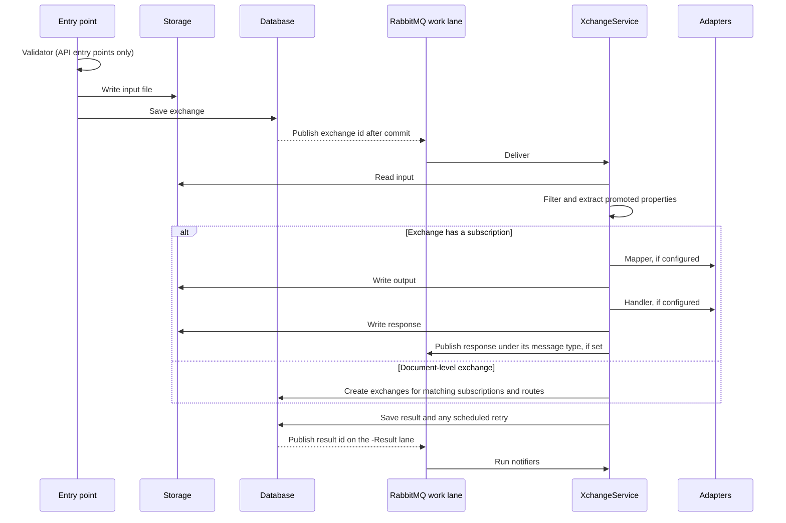

# Exchange pipeline

This page follows one message from arrival to result. [Entry points](entry-points.md) covers how each kind of message arrives.

## Overview



Every stage runs its adapter through the same invoker, whether the adapter is native, resident or classic. A stage bound to a [data source](data-sources.md) runs through that connection.

## 1. Creation

Every entry point ends the same way. The input is written to storage, the exchange row is added and the save commits. After the commit, an event carrying only the exchange id goes to the lane of the subscription's work group.

When an exchange is created for a subscription, Bitween resolves `{{partner.KEY}}` and `{{globals.SET.KEY}}` tokens in the mapper and handler properties and stores the result on the exchange. The partner is the one the entry point supplies, such as the calling partner or a bus gateway route's partner. Otherwise it is the subscription's own partner. Tokens that cannot be resolved are left as written.

Because properties are copied onto the exchange, later edits to the subscription do not affect exchanges that already exist. A retry with *re-resolve adapter properties* picks up the current configuration.

## 2. Validation

The validator runs only at two entry points: API gateways and the legacy `POST /api/xchanges/{informationType}` endpoint. It runs synchronously, before the exchange is created. A failed validation returns a validation error to the caller and stores nothing.

Scheduled jobs, bus messages, aggregations and exchanges created by hand never run a validator.

## 3. Filtering and promoted properties

Processing starts by reading the input in the information type's format.

- **JSON** payloads are read with JSON path expressions. Only a JSON object can be read, so a payload whose root is an array yields no promoted properties and matches no filter.
- **XML** payloads are read with XPath, after decoding HTML entities and removing characters XML does not allow. A payload that is not valid XML fails the exchange.

Promoted property values are stored as sent. Search compares them ignoring case.

For a document-level exchange, the filter also decides where the document goes.

- Internal subscriptions of the information type match when their match expression passes, or always when they have none.
- Bus gateway routes of the information type match the same way, unless their gateway is deactivated.
- API gateway, bus gateway, scheduled job and legacy API call subscriptions are never matched by content. They only run through their own entry point.

### Match expressions

A match expression is a tree of conditions, stored as JSON.

```json
{
  "type": "and",
  "left":  { "type": "one_of",     "path": "order.country", "values": ["JO", "AE"] },
  "right": { "type": "not_one_of", "path": "order.status",  "values": ["cancelled"] }
}
```

| Type | Matches when |
|---|---|
| `one_of` | The value at `path` equals one of `values`, ignoring case |
| `not_one_of` | The value at `path` is missing or equals none of `values` |
| `and`, `or` | Both, or either, of `left` and `right` match |

Paths are read from the payload with the same reader as promoted properties. Older subscriptions may have a *document filter* instead, keyed by promoted property name with comma-separated values. Bitween turns each entry into a `one_of` condition and joins them with `and` at run time.

## 4. Mapping

When the exchange has a mapper, the mapper turns the input into the output file. It receives its properties plus an `xchangeid` entry.

How the mapper sees partner and global values depends on the mapper.

- The **rules-based mapper**, `NativeMapper`, receives partner and global values as separate context. The payload reaches it untouched, so it can map XML as well as JSON.
- **Every other mapper**, including the legacy JSON mapper and custom mappers, gets them written into the payload as `__partner__` and `__globals__` keys, and only when the payload is a JSON object. A payload that is not JSON fails the exchange before the mapper runs. A real payload key with either name is overwritten.

A mapper that returns nothing fails the exchange. See [Mapping](mapping.md).

## 5. Delivery

When the exchange has a handler, it receives the output file, or the input file when there is no mapper. It can return a response, which is stored as the response file. A handler can flag its response as bad data, as the HTTP handler does for 4xx replies.

An exchange with neither a mapper nor a handler simply succeeds.

A handler bound to a data source can publish to a customer's broker or run SQL against a database. See [External brokers](external-brokers.md#delivering-to-a-broker) and [Databases](databases.md#writing-with-a-handler).

## 6. Response routing

After the handler returns a response:

- When the subscription has a **response message type name**, the response is published to RabbitMQ under that name, unless it was flagged bad. Any bus-enabled information type with that message type name receives it as a new document, so the flow can continue through a bus gateway.
- When the subscription has a legacy **response subscription**, a new exchange is created on that subscription with the response as its input and the same correlation id. This happens even when the response was flagged bad. The admin UI can clear this link but no longer sets it.

A subscription cannot route its response into itself or into a bus gateway subscription.

## 7. Result

Bitween saves the result.

- After a success, any retry budget of the subscription that was exhausted before this exchange started is released.
- After a bad response or an exception, the retry policy is evaluated and may schedule a delayed retry. See [Retries and alerts](retries-and-alerts.md).

Retry evaluation can never cost the result. If evaluation itself fails, the error is logged and the result is still saved.

## 8. Notifications

Saving the result publishes its id on the work group's `-Result` lane. There, each active notifier that watches the exchange's subscription runs when the outcome matches its settings. See [Notifiers](retries-and-alerts.md#notifiers).

## Pausing

While a subscription is paused, messages that reach it by content are stored as on-hold exchanges. That covers documents matched to internal subscriptions and bus gateway routes. Resuming the subscription publishes an event that turns every on-hold exchange into a real exchange and deletes the holds.

API gateway calls, legacy API calls, scheduled job runs, aggregations and exchanges created by hand ignore the pause and still create exchanges.

## Aggregation

An aggregation subscription runs on a schedule. Each run does the following.

1. Selects up to 10,000 successful exchanges of the source subscription that have not been aggregated yet.
2. Builds a JSON array holding the URL of one file of each exchange: input, output or response, as configured.
3. Creates one exchange on the aggregation subscription with that array as its input, and links each source exchange to it.

The new exchange then runs through the normal pipeline, so the aggregation's own mapper and handler process the list. Because file URLs are used, the files must be reachable by whatever processes the list.

The first run of a new aggregation collects everything the source subscription has ever produced. The UI therefore creates aggregations disabled by default.

## Files and URLs

Exchange lists return a URL and a storage key for each file that has content. The UI reads file content through `GET /api/bitweendocs?documentKey=...`.

## Limits

| Limit | Value |
|---|---|
| Request body size | 50 MB |
| Exchanges counted by one search | 10,000 |
| Exchanges collected per aggregation run | 10,000 |
| Concurrent exchanges per consumer | The work group's prefetch, 12 by default |
