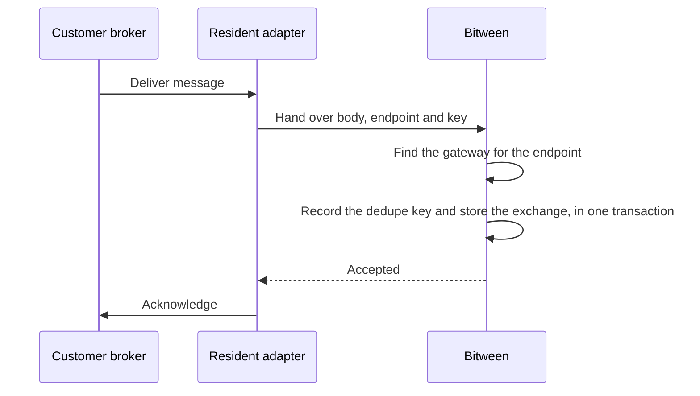

# External brokers

Bitween can read from and publish to a broker the customer runs, through a [data source](data-sources.md). Two brokers are supported.

| Provider | Adapter id |
|---|---|
| RabbitMQ | `bitween.bus.rabbitmq` |
| Amazon SQS | `bitween.bus.sqs` |

There is no Kafka, Azure Service Bus or MQTT provider.

## Receiving through a bus gateway

A bus gateway reads either from Bitween's internal bus, as before, or from a broker data source.

1. Create a broker data source and test its connection.
2. Open the bus gateway and choose its **source**: the internal bus, or a broker data source plus an **endpoint**. The endpoint is the queue name for RabbitMQ, or the full queue URL for SQS.
3. Add routes as usual.

Two gateways on one data source cannot read the same endpoint. A gateway can be moved between the internal bus and a broker later, but its information type stays fixed.

### What happens to a message

- The message body becomes the input of a document of the gateway's information type. From there it runs through the filter and routes like any bus message. See [Entry points](entry-points.md#bus-gateways).
- **The adapter acknowledges the broker only after Bitween has stored the exchange.** If Bitween refuses or is down, the message is requeued rather than lost.
- A message on an endpoint no gateway claims is acknowledged and discarded, with a warning in the log.

### Deduplication

A crash between storing and acknowledging makes the broker redeliver, so Bitween remembers a key per message.

| Provider | Key |
|---|---|
| RabbitMQ | The AMQP `message-id` property. **Messages without one are never deduplicated.** |
| SQS | The SP-API notification id when unwrapping is on, otherwise the SQS message id |

The key is stored with the exchange in one transaction. A second delivery of the same key on the same data source is acknowledged without creating another exchange. Keys are kept for the data source's deduplication window, 30 days by default, and a nightly job deletes older ones. A window of 0 turns deduplication off.

## Delivering to a broker

A subscription can publish its output to a broker.

1. Set the subscription's delivery adapter to `bitween.bus.rabbitmq` or `bitween.bus.sqs`.
2. Bind the subscription to the broker data source.
3. Fill in where to publish.

| Provider | Delivery properties |
|---|---|
| RabbitMQ | `Endpoint` (queue), or `Exchange` with an optional `RoutingKey`. One of `Endpoint` or `Exchange` is required. `ContentType` is optional. |
| SQS | `Endpoint` (queue URL, required). For FIFO queues, `GroupId` (default `bitween`) and `DeduplicationId` (default the exchange id). |

- Publishing works from any enabled node. A node that does not hold the consuming connection opens a send-only one.
- The response file is the broker's receipt: the message id and size for RabbitMQ, or the message id and sequence number for SQS.
- A failed publish fails the exchange, so retry policies apply.
- RabbitMQ publishes without publisher confirms, so a broker that drops a message after accepting it is not detected.
- The message id is the exchange id, and a retry is a new exchange, so a retried publish carries a different id.
- A subscription binds one data source, so it cannot read from a database and publish to a broker in one step. Chain two subscriptions instead.

## RabbitMQ settings

| Setting | Default | Notes |
|---|---|---|
| `Host` *(required)* | `localhost` | Host name only; one host |
| `Port` | `5672` | Use 5671 with TLS |
| `UserName` *(required)* | `guest` | |
| `Password` *(required, secret)* | | |
| `VirtualHost` | `/` | |
| `UseSsl` | `false` | TLS, validating the certificate against `Host` |
| `DeclareMode` | `assert` | `none` trusts the queues exist. `assert` checks them at start and fails if one is missing. `create` declares queues, and the exchange and bindings when `Exchange` is set. |
| `Exchange`, `ExchangeType`, `RoutingKey` | `topic` for the type | Used by `create` mode for bindings |
| `Prefetch` | `16` | Shared by every endpoint on the connection |
| `Durable` | `true` | Queue durability in `create` mode, and persistent delivery when publishing |
| `QueueType` | | `classic`, `quorum` or `stream`, in `create` mode |

The connection test checks the connection, authentication and each gateway queue. Discover lists only the configured queues with their depth.

## SQS settings

| Setting | Default | Notes |
|---|---|---|
| `Region` *(required)* | `eu-west-1` | |
| `AccessKeyId`, `SecretAccessKey` *(secret)* | | Leave both blank to use the node's AWS credential chain |
| `ServiceUrl` | | For LocalStack or ElasticMQ |
| `WaitTimeSeconds` | `20` | Long polling, 0 to 20 |
| `MaxMessagesPerReceive` | `10` | 1 to 10 |
| `VisibilityTimeoutSeconds` | `60` | |
| `UnwrapSellingPartnerNotification` | `false` | For Amazon Selling Partner API notifications. Forwards only the payload, and uses the notification id as the dedupe key. |

A refused message is made visible again straight away. The connection test calls `ListQueues`, so the credentials need `sqs:ListQueues`, and it warns when a queue's visibility timeout is under 30 seconds. Discover lists up to 100 queues.

## Limits

- Per-endpoint settings on a gateway are stored and passed to the adapter, but neither provider reads them.
- Test, Discover and the live panel run on the node that serves the request.
- Settings changes reach the adapter within 30 seconds, and restart it.
- [Data source limits](data-sources.md#limits) apply as well.
